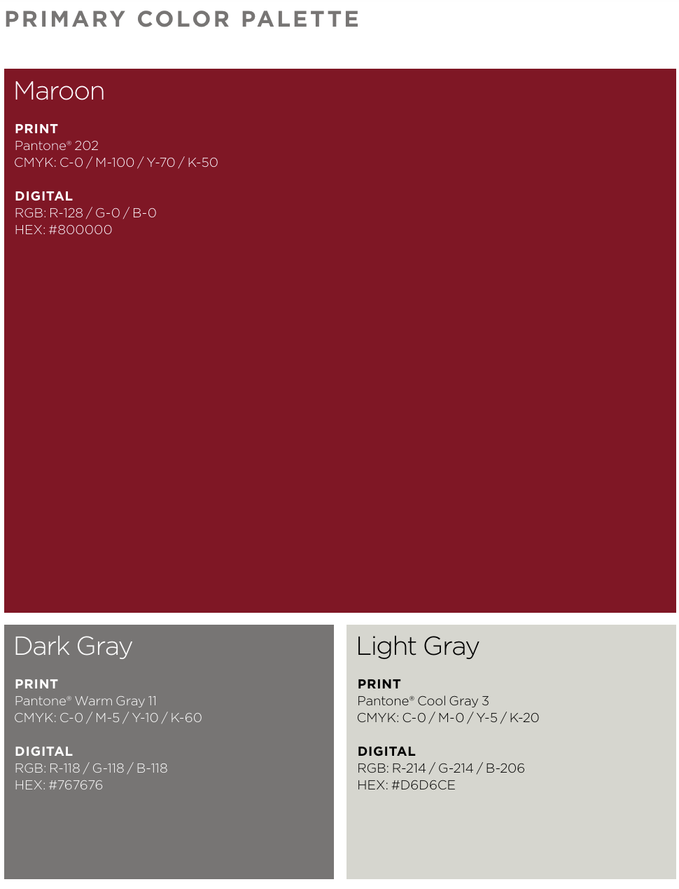
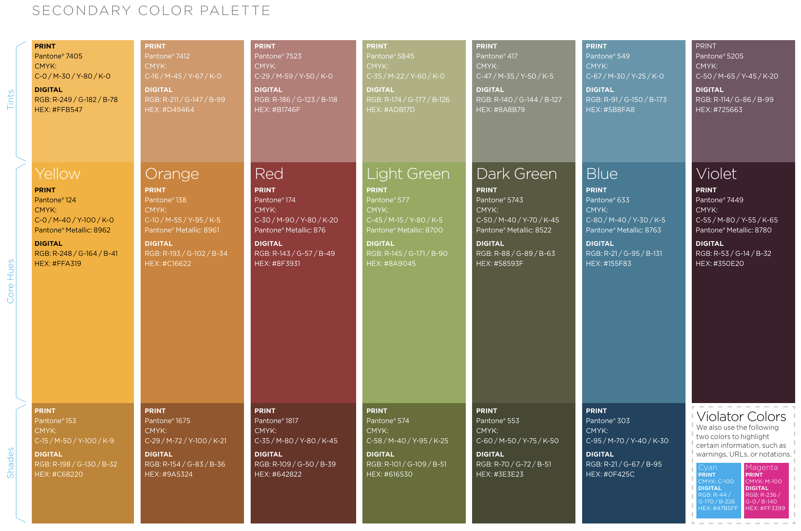

# Contributors Guide
Interested in writing a story with the Maroon Data Team? Follow the steps below.

1. If you are new, please complete all the [getting started](#from-the-very-beginning) steps.
2. Claim a story on the pitch document (see Slack channel for document) or pitch a new story. Fill out Data Team Story Outline and send to a Data Editor for review.
3. Research, write, and create any visuals needed for your story. Feel free to create draft versions of visual using any program or language that you would like. Published visuals will need to be created with the [build process](#build-process-for-a-visualization). Any other visuals must be approved by your editor. Visuals must the Maroon's Data [Style Guide](#style-guide)

## Getting Started

### Setup
1. Make a Github account and learn about version control (git). 
    - Make an account with github if you do not have one: : https://github.com/join
    - You may also want to download [GitHub Desktop](https://desktop.github.com/), which will allow you to manage repositories on your computer using a graphical user interface, and work with any code environments on your computer (e.g. VSCode, WebStorm, etc.)
    - There are lots of resources to learn about version control using git. Below are a few we recommend but I would recommend exploring other resources if these are unclear
        - Version Control by [The Missing Semester from MIT](https://missing.csail.mit.edu/2020/version-control/)
        - [CAPP Camp Git I and Git II](https://uchicago-capp30121-aut-2022.github.io/capp-camp/s2-git-i/)
        - [GitHub Feature Branches](https://www.atlassian.com/git/tutorials/comparing-workflows/feature-branch-workflow)
        - [GitHub Pull Requests](https://www.atlassian.com/git/tutorials/making-a-pull-request)

2. Clone the data-visualization repo locally
    - Learn more about cloning [here](https://uchicago-capp30121-aut-2022.github.io/capp-camp/s3-git-ii/1-working-from-multiple-locations.html#using-git-clone)

3. Download a code editor
    - If you have a strong opinion about which code editor to use, download [Visual Studio Code](https://code.visualstudio.com/) (often just called VS Code)
        - learn more about code editors generally [here](https://missing.csail.mit.edu/2020/editors/)
        - learn more about VS Code [here](https://uchicago-capp30121-aut-2022.github.io/capp-camp/s1-linux/2-vs-code-layout.html)

4. Download these software that will allow you to run Javascript, the programming language w  write our visualizations in:
    - [node.js](https://nodejs.org/en) `v20.9.0`
        - to install the correct version, in the terminal you can run 
            1. Install [Node Version Manager](https://github.com/nvm-sh/nvm) with `curl -o- https://raw.githubusercontent.com/nvm-sh/nvm/v0.37.2/install.sh | bash` 
            2. Install the correct version of Node `nvm install 20.9.0`. If you are getting error of NVM not recognized then run `source ~/.nvm/nvm.sh` and then run above again. 
            3. Set this version as the default by running `nvm alias default 20.9.0` and `nvm use 20.9.0`
            4. Confirm the correct version is installed by running `node -v`. This should return `v20.9.0`

5. After you have cloned the repo and downloaded Node, go to the base folder of the `data-visualizations` repository and run the command `npm ci` to install all package dependencies.

### Tools and Skills to Review
Programming is a skill that you learn by doing. There is no expectation that someone fully understands a programming language or package before they can start creating things. Much of the process is about learning as you go and building a muscle of problem solving and debugging as you go.
With that being said use the resources below as a starting place and reference source. Learning just enough to jump into a project and learning the rest as you go. 
- We primarily use [`HighCharts`](https://www.highcharts.com/) a javascript library to build visualizations.
   - The best place to start is to find a chart you like under the `Demos` tab on the Highcharts website and review the code. When creating a data visualization, finding a template from Highcharts similar to what you’re trying to develop and working off the existing JavaScript code from the Highcharts template can be beneficial. You can find the code for that specific visual under the `View Code` or `Copy JS code` tabs under the visualization.
- Other tools includes
    - For mapping, we have used [Leaflet](https://leafletjs.com/) an open-source JavaScript library
for mobile-friendly interactive maps   
    - For more customizable interactive visualizations, [D3.js](https://observablehq.com/@d3/gallery?utm_source=d3js-org&utm_medium=nav&utm_campaign=try-observable) has become a popular package. There is a steep learning curve for this tool but gives you total control over your visuals. 

## Build Process for a Visualization 
1. Go to the base folder of the `data-visualizations` repository ensure your local repo is up to date with the remote repo by running `git checkout main` and `git pull`
2. Create a branch for you story by running `git checkout -b '[kebab-case-story-name]'`. Read more about kebab-case [here](https://www.freecodecamp.org/news/programming-naming-conventions-explained#what-is-kebab-case).
2. In the terminal run `npm run create-visual --year=[year] --story=[kebab-case-story-name]`  This will create a folder with all the necessary files to create your visual.
    - If it is the year `2024` and your story is called `Example Visual` then run the command `npm run create-visual --year=2023 --story=example-visual` using the year `2024` and your story's name `example-visual` in kebab-case.
    - In your `./[year]/[story-name]/` folder, there will be a file called `main.js`. This is where you’ll write the JavaScript logic for your visual.
3. Start creating your visual that will be housed in the `./[year]/[story-name]/` folder.
    - If you'd like to see previously created example visuals, open [example-graphs.html](./example-graphs.html) from your local repository.
    - If you are using Highcharts, [this site](https://api.highcharts.com/highmaps/) gives a lot of helpful documentation on the options for creating charts.
4. Update the `meta_data.json` in your story's folder, which will look something like this:
   ```json
   {
     "title": "Example Visual",
     "description": "Describe your visual"
   }
   ```
    - Make sure the title you write in the `meta_data.json` file is the same as the title you give your visual in `main.js` and in `index.html`'s `<title>` tag.
5. Run `npm run lint` and make the changes that the output recommends.
6. Go to the base folder of the `data-visualizations` repository and run the command `npm run process-visual --year=[year] --story=[kebab-case-story-name]`
   - Example: `npm run process-visual --year=2023 --story=example-visual`
7. Create a Pull Request to have your visual reviewed by committing and pushing your changes.
    - You can run `git status` to see which files in red have not been added. Then run `git add [file-name]` for each file to add them. Next run `git commit -m '[commit message]'` to commit your changes. Then run `git push` to push your changes. If this is your first commit, github may ask you to run a different command, which you should. Ex `git push --set-upstream origin [branch-name]`

 

## The Chicago Maroon’s Data Contribution and Style Guide

### Contribution Standards

#### Pull Request Titles

They should be written in the present imperative tense. Examples of that tense are:
"Fix issue in the dispatcher where…", "Improve our handling of…", etc."

#### Pull Request Information

All pull requests should contain a still of the image and be linted, minified, contain no more imports than needed, and approved by at least one of the Lead Developers.

### Style Standards

Examples for updated style guides
- https://urbaninstitute.github.io/graphics-styleguide/
- https://bbc.github.io/rcookbook/


#### Font

The font is set via the [`main.css`](./static/main.css) file. The default font, and the one used on the rest of _The Chicago Maroon_, is Georgia, serif font: [Link](https://www.cssfontstack.com/Georgia).

#### Titles and Subtitles

Titles and subtitles should meet the following constraints:

-   They should not take up more than one line each.
-   They should be centered, not left or right-justified.
-   Links should be added using [anchor tags](https://developer.mozilla.org/en-US/docs/Web/HTML/Element/a).

#### Colors

Color palates are based off the [UChicago style guide](https://news.uchicago.edu/sites/default/files/attachments/_uchicago.identity.guidelines.pdf).






